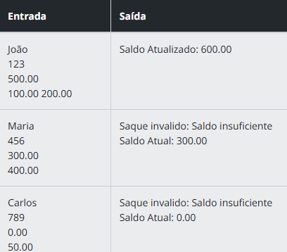

# Descrição 

Implemente um sistema bancário que permita criar contas com informações como nome do titular, número da conta e saldo. O programa deve fornecer métodos para:

 - Consultar o saldo.
 - Realizar saques e depósitos.  

Garanta que os atributos da conta estejam encapsulados e sejam acessados apenas por métodos específicos.

# Entrada
 - Consultar o saldo.
 - Realizar saques e depósitos.

# Saída
Saldo atualizado após cada operação ou mensagem de erro caso a operação não seja válida (ex.: Saque invalido: Saldo insuficiente), conforme tabela de exemplos.

# Exemplos
A tabela abaixo apresenta exemplos com alguns dados de entrada e suas respectivas saídas esperadas. Certifique-se de testar seu programa com esses exemplos e com outros casos possíveis.  
