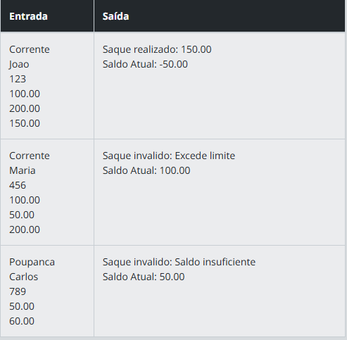

# Descrição 

Crie um sistema bancário que suporte diferentes tipos de contas: Conta Corrente e Conta Poupança. Ambas as contas devem herdar de uma classe base Conta e implementar suas próprias regras para saques:  

Conta Corrente: permite saques mesmo com saldo negativo, até um limite de cheque especial.  
Conta Poupança: não permite saldo negativo.

# Entrada
Tipo da conta (Corrente ou Poupança), informações iniciais (nome do titular, número da conta, saldo e limite de cheque especial para contas correntes) e a sequência de operações (saques e depósitos).

# Saída
Saldo atualizado após cada operação, ou mensagens indicando que a operação não é permitida como:

Para o caso onde, excede o limite:  
Saque invalido: Excede limite  
Saldo Atual: 100.00

Para o caso onde, o saldo é insuficiente:

Saque invalido: Saldo insuficiente  
Saldo Atual: 50.00

# Exemplos
A tabela abaixo apresenta exemplos com alguns dados de entrada e suas respectivas saídas esperadas. Certifique-se de testar seu programa com esses exemplos e com outros casos possíveis.  
