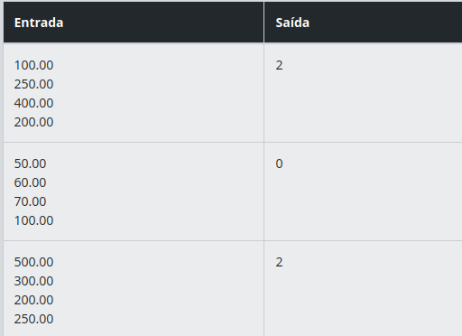

# Descrição 
Implemente um programa que leia uma lista de valores de transações e conte quantas dessas transações são superiores a um valor mínimo especificado pelo usuário.

# Entrada
O programa deverá receber exatamente 4 entradas, onde:
- As 3 primeiras entradas representam os valores das transações realizadas.
- A 4ª entrada será o valor mínimo que servirá como critério de comparação.

# Saída
O programa deverá exibir um único número inteiro, que é o total de transações cujos valores são maiores que o valor mínimo.

## Regras Importantes:
- As entradas devem ser fornecidas linha por linha.
- A ordem das entradas é importante:
    - Primeiras 3 linhas: valores das transações.
    - 4ª linha: valor mínimo.

# Exemplos
A tabela abaixo apresenta exemplos com alguns dados de entrada e suas respectivas saídas esperadas. Certifique-se de testar seu programa com esses exemplos e com outros casos possíveis.

