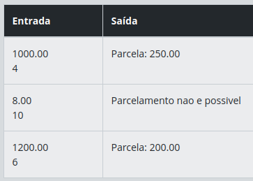

# Descrição 
Implemente um programa que simule o parcelamento de um pagamento. O programa deve receber o valor total e o número de parcelas, e calcular o valor de cada parcela. Caso o número de parcelas seja maior que o valor total, o programa deve indicar que o parcelamento não é possível.

# Entrada
- Um número decimal representando o valor total.
- Um número inteiro representando o número de parcelas.

# Saída
O valor de cada parcela ou uma mensagem indicando que o parcelamento não é possível.

# Exemplos
A tabela abaixo apresenta exemplos com alguns dados de entrada e suas respectivas saídas esperadas. Certifique-se de testar seu programa com esses exemplos e com outros casos possíveis.

